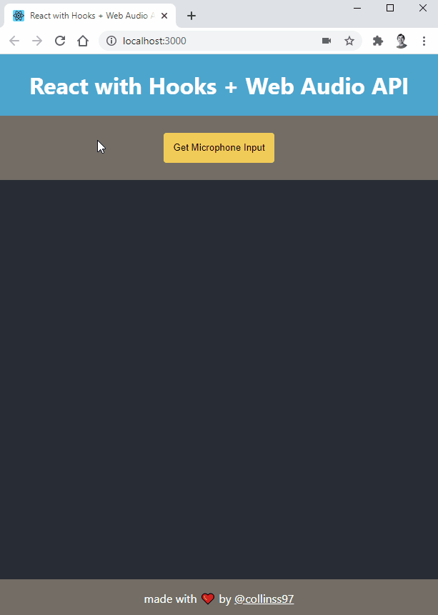

# react-web-audio

This is an example application that shows how to visualise audio from the microphone using the Web Audio API in React.



This project was inspired by [Phil Nash's react-web-audio project](https://github.com/philnash/react-web-audio). The key difference is that this project uses functional React components using hooks.

## Demo

Try out the [live demo](https://react-web-audio.netlify.app/).

## Run the app

Clone the project and install the dependencies.

```bash
git clone https://github.com/collinsspencer/react-web-audio.git
cd react-web-audio
npm i
```

Start the application:

```bash
npm start
```

This should open the browser to http://localhost:3000/.

## Building a React App with the Web Audio API

These are the three files I used to split up the logic. I've added notes below as well.

```jsx
// App.jsx

const App = () => {
  const [audio, setAudio] = useState();

  const getMicrophone = async () => {
    const audioMedia = await navigator.mediaDevices.getUserMedia({
      audio: true,
      video: false,
    });
    setAudio(audioMedia);
  };

  return (
    <div className="App">
      <button onClick={getMicrophone} type="button">Listen</button>
      <AudioAnalyser audio={audio} />
    </div>
  );
};
```

```javascript
// AudioAnalyser.jsx

const AudioAnalyser = ({ audio }) => {
  const [analyser, setAnalyser] = useState();

  const getAudioData = () => {
    if (!analyser) return [];
    const bufferLength = analyser.frequencyBinCount;
    const dataArray = new Uint8Array(bufferLength);
    analyser.getByteTimeDomainData(dataArray);
    return dataArray;
  };

  useEffect(() => {
    if (!audio) return () => {};
    const audioContext = new (window.AudioContext ||
      window.webkitAudioContext)();
    const source = audioContext.createMediaStreamSource(audio);
    const newAnalyser = audioContext.createAnalyser();
    source.connect(audioContext.destination);
    source.connect(newAnalyser);
    setAnalyser(newAnalyser)

    return () => {
      newAnalyser.disconnect();
      source.disconnect();
    };
  }, [audio]);

  return <Visualiser getAudioData={getAudioData} />
};
```


```javascript
// Visualiser.jsx

const Visualiser = ({ getAudioData }) => {
  const canvasRef = useRef();
  const requestRef = useRef();

  const draw = (audioData) => {
    const canvas = canvasRef.current;
    const context = canvas.getContext('2d');
    ...
  };

  const animate = useCallback(() => {
    const audioData = getAudioData();
    draw(audioData);
    requestRef.current = requestAnimationFrame(animate);
  }, [getAudioData]);

  useEffect(() => {
    requestRef.current = requestAnimationFrame(animate);
    return () => cancelAnimationFrame(requestRef.current);
  }, [animate]);

  return <canvas width="600" height="256" ref={canvasRef} />;
};
```

### Notes

#### `useRef` with `requestAnimationFrame`

Visualizing audio data can get tricky in React because the visual components are updated by `requestAnimationFrame` rather than React. There is an [article on css-tricks](https://css-tricks.com/using-requestanimationframe-with-react-hooks/) that covers how to use `requestAnimationFrame` in React with hooks. It's a really good read that covers why the `useRef` hook is necessary for `requestAnimationFrame`. TL:DR, we need the ever-changing request animation frame ID in order to cleanup, but `useEffect` can only ever see the initial state.

`requestAnimationFrame` is looped to get the most recent audio data. This audio data comes from the one of the analyser's `get...Data()` methods (see the docs on [AnalyserNode](https://developer.mozilla.org/en-US/docs/Web/API/AnalyserNode) for the different methods).

#### Three approaches for getting the audio data

One approach would be to run the `requestAnimationFrame` loop in the `AudioAnalyser` and save the updated audio data to the state. The actual audio data could then be passed down to the visualiser, which could simply draw the audio data. This isn't the idea approach though as it forces a rerender of the entire visualiser component. With `requestAnimationFrame` running potentially 60 times per second, this creates an unnecessary number of rerenders.

Another approach would be to pass the analyser down to the visualiser, but that leads to some separation of concerns issues.

The approach I ended up going with here avoided passing the analyser down to the visualiser. I instead chose to _pass a function_ to get the data down to the visualiser. This function simply gets the data so that the visualiser can redraw.

### Other Notes

#### Alternatives to microphone audio

In this example, `audio` is a [`MediaStream`](https://developer.mozilla.org/en-US/docs/Web/API/MediaStream) for use with the `AudioContext.createMediaStreamSource()` method.

You could also use an [`HTMLMediaElement`](https://developer.mozilla.org/en-US/docs/Web/API/HTMLMediaElement) with the `AudioContext.createMediaElementSource()` function. This means that you could do the same visualisations with audio from `<video>` or `<audio>` elements.

#### Compatibility

Safari only uses `webkitAudioContext` instead of `AudioContext`.

I'm sure there are more compatibility concerns...

#### Read up on `useEffect`

Returning a function in `useEffect` is useful for cleanup on unmount with React Hooks. Also, the second parameter for dependencies is important for minimizing rerenders.
